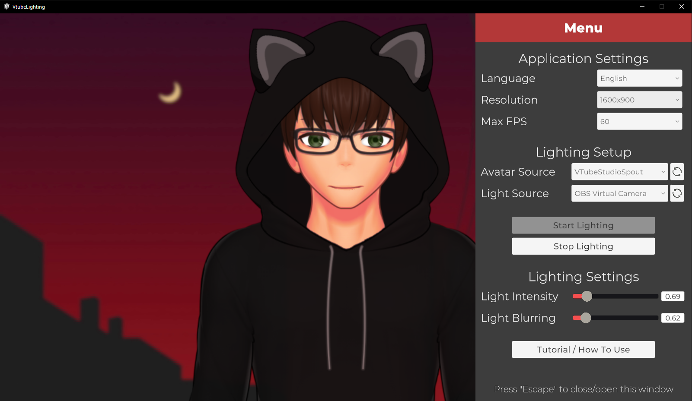
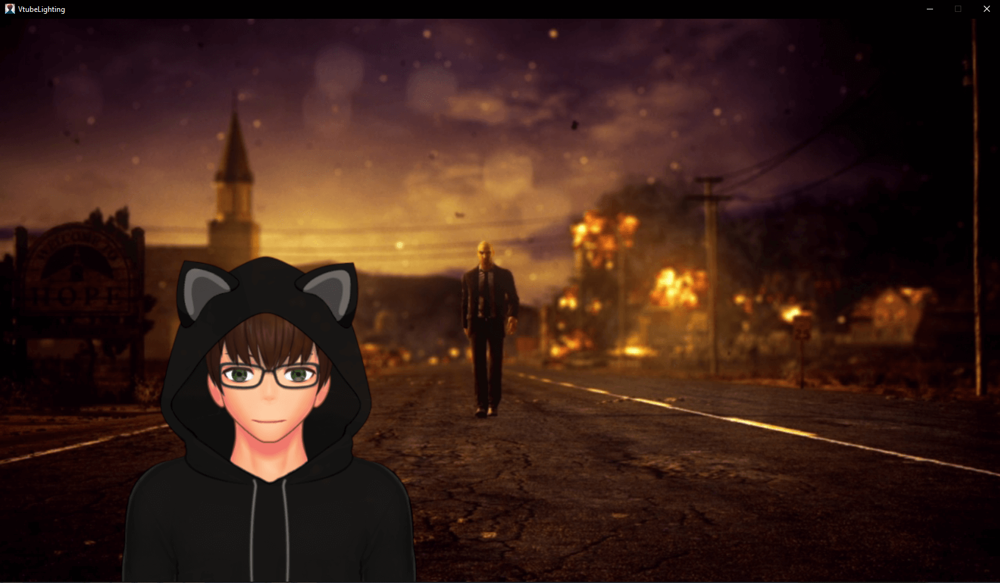
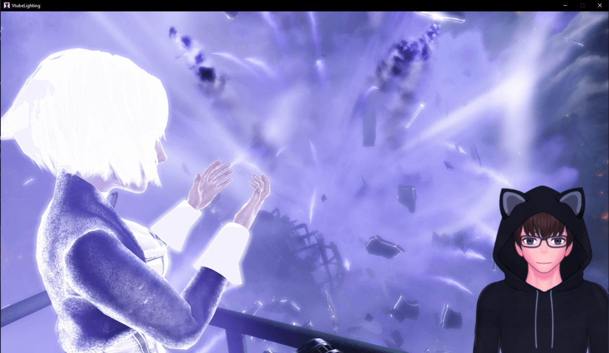
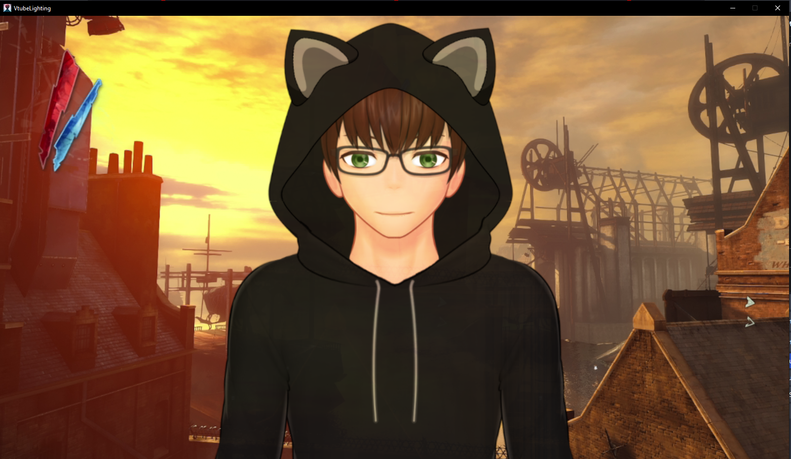

# ⚠ Experimental

# VtubeLighting

Spout2 powered Vtubing application to implement screen lighting without these annoying yellow borders !

</img> 
</img> 
</img> 
</img>

## Features

- Lightweight (around 5% CPU usage on my Ryzen 5 3600 and 160MB of ram usage)
- No distracting yellow borders around the window
- The user interface is invisible in your streaming software
- 100% Open Source & 100% Free, FOREVER
- Can be easily translated (look at `VtubeLighting_Data\Resources\Translations`)
## Requirements
* A Vtubing software compatible with Spout2 (Vtube Studio, VSeeFace, ...)
* A streaming software compatible with Spout2 (OBS Studio with 3rd party plugin)
* A DirectX 11 or 12 compatible graphic card
* VtubeLighting requires the use of the OBS Virtual Camera so you won't be able to use it for anything else, but it's not a big deal since most vtuber apps have support for virtual cameras

## Setup

Don't be affraid if the following steps seems difficult, once everything is setup this will be easier =)

If you prefer a video tutorial instead of reading this, feel free to watch [this video](https://www.youtube.com/watch?v=023tl29R6YA) !

1. Download **VtubeLighting** from [Github Releases](https://github.com/DayMoniakk/VtubeLighting/releases)

2. Open **VtubeLighting**

3. In *Lighting Settings* you have to tell the software how to get your Vtuber Avatar :
In Vtube Studio click go into the **settings**, click on the **camera icon** and scroll down to where it says *Spout2 Config*. If you have not installed it yet click on **Install Spout2**. Then click **Activate Spout2**.

4. Go back to **VtubeLighting**, click on the **refresh button**. If Spout2 is correctly installed and enabled you can already see that **VTubeStudioSpout** is automatically selected
for you !

5. Now that we have our Vtuber Avatar imported into *VtubeLighting* it's now time to setup the lighting ! Start OBS Studio, create a **new scene**, this scene is basically responsible to light up your avatar. You can for example put your **Game Capture** inside this scene so your avatar will receive lighting from it.

6. Now look at bottom right of OBS, there is a button called **Start Virtual Camera**: click on the **gear icon** next to it. For the **Output Type** select **Scene** and for **Ouput Selection** select the **new scene you created earlier**.
Click **OK** and **Start Virtual Camera**.

7. Head back to **VtubeLighting**, in **Lighting Setup** there is an option called **Light Source**: use the refresh button and you should automatically have **OBS Virtual Camera** selected.

8. Now you can finally use the **Start Lighting** button ! Your OBS scene is now visible inside the application. The last thing you need to do is to increase the value of **Opacity** and your Avatar is now receiving lighting from OBS ! You can control how much lighting you want from the OBS scene using the **Intensity** slider.

9. You also have a setting called **Update Rate**, this is simply how often the lighting is updated, by default it's 8 so the lighting is update 8 times per second. The highest the value is the best is the effect but the performance cost increases.

10. Once you are happy with the results it's time to send back your vtuber avatar to OBS, there's 2 methods you can use:
* Install the [Spout2 Plugin for OBS Studio](https://docs.offworld.live/#/obs-spout-plugin/README), add a **Spout2 Capture** in your streaming scene and select **VtubeLighting** in **SpoutSenders**.
* Use a **Game Capture** source, keep in mind that Spout2 is the preferred method because it doesn't produce any CPU load.
## Notes

* VtubeLighting supports transparency, so if your OBS Scene has transparency in it you will get it back.
* The application is built in `Unity 2022.3.4f1` using the built-in render pipeline and the shadergraph, feel free to modify the VtubeLighting !
* If you're building the application from the source and adding new translations make sure to include the **Translation** folder from `VtubeLighting\Assets\Translations` to `VtubeLighting_Data\Resources\Translations` after exporting. Also The KlakSpout library used to handle Spout2 is stored directly inside the project folder instead of the usual path because I had to fix a bug for newer Unity versions.
## Credits

* VtubeLighting wouldn't exits without [KlakSpout](https://github.com/keijiro/KlakSpout) created by [Keijiro Takahashi](https://github.com/keijiro).
* The [Montserrat](https://github.com/JulietaUla/Montserrat) font created by [JulietaUla](https://github.com/JulietaUla)
* The [Unity Engine](https://unity.com/) and its infamous mandatory splash screen :p
* Logo by [Bing AI](https://www.bing.com/?/ai) (he told me he appreciates some credits =D)
## FAQ

#### Why creating this app ?

Having this kind of lighting effect was always something I wanted, before VtubeLighting there was only 2 ways to achieve a similar effect:
* Using **Display Lighting** in VtubeStudio, but you'll get a yellow border around your game window which is very distracting !
* Using **StreamFX** which is no longer free :/
So what a programmer does when the tools he wants aren't available ? He simply creates the tools by himself and that's exaclty what I did !
And I want everyone to enjoy it too, Vtubing is like a big family, we have to help us each others ♡

#### Why do I have a warning when opening the app ?

It's because of **Windows Smart Screen**, basically it just tells you that the software is coming from an unknow source. To verify executables developers have to sign their applications, this is a costly procedure and I don't want to get through this hassle.
There's no virus involved here, but if you don't trust my executable it's totally fair, just don't use VtubeLighting or compile your own executable from the project file.

#### Is there a Linux or Mac version ?

Sadly no, I don't have a Linux and Mac operating system and I refuse to give you something that I can't test myself.
Also, Spout2 requires you to have DirectX 11 or 12, I have no clue if Mac supports this.
But this project is **entirely Open Source** so feel free to try it out by yourself !

#### Can I use this commercially

Feel free to do **whatever you want** with this, VtubeLighting is **free** and will remain **free forever** !
All I ask is to credit me if you're creating a new software with my code, that would be nice of you :)

#### How do I translate the application in my language

You can duplicate the `english.json` file inside `VtubeLighting_Data\Resources` and edit the lines. VtubeLighting will automatically scan this folder to check for new translations.

### Other questions or issues ?

Feel free to post in [discussions](https://github.com/DayMoniakk/VtubeLighting/discussions) if you have a Github account, if not you can also send me a message on my [Twitter](https://twitter.com/DayMoniakk) !
